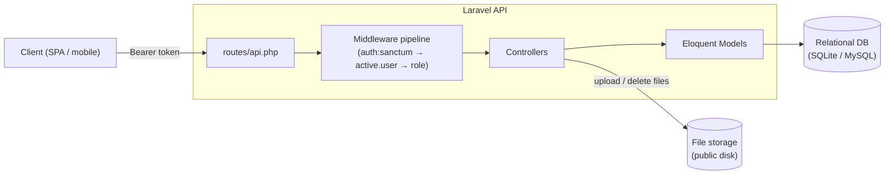
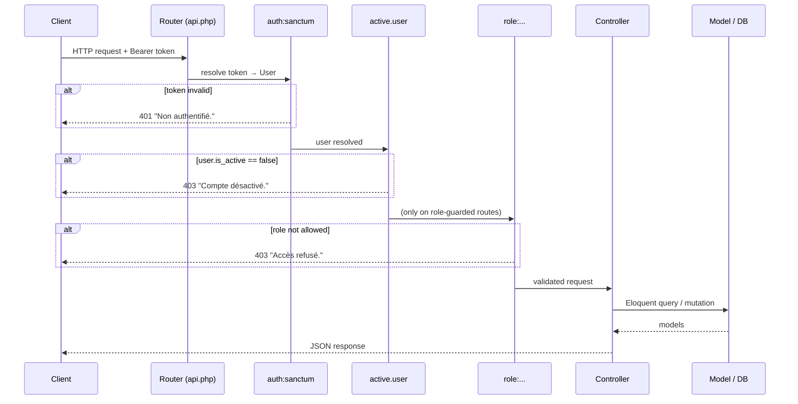
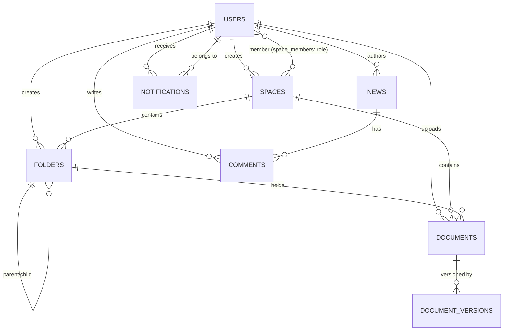

# get-2m — Architecture

> Backend API for an internal document-management & collaboration platform (GED /
> "Gestion Électronique de Documents"). Built with **Laravel 13** (PHP 8.3) and
> token authentication via **Laravel Sanctum**. The API is stateless and JSON-only.

---

## 1. High-level overview

get-2m exposes a REST API that lets an organization's members store and version
documents, organize them in spaces and folders, publish news with comments, and
receive notifications. Access is governed by a global role (`admin`,
`responsable`, `user`) and by per-space roles (`admin`, `contributeur`,
`lecteur`).

- **Stateless auth**: every protected request carries a Sanctum personal access
  token (`Authorization: Bearer <token>`). No server-side session is used for the
  API.
- **JSON everywhere**: exceptions are rendered as JSON for `api/*` requests
  (`bootstrap/app.php`), and unauthenticated requests get a `401` JSON body
  instead of a redirect.
- **File uploads** are written to the `public` storage disk; each document keeps
  an immutable history in `document_versions`.

---

## 2. Layered request lifecycle

### Middleware

| Alias          | Class                                            | Responsibility |
| -------------- | ------------------------------------------------ | -------------- |
| `auth:sanctum` | Sanctum guard                                    | Resolve the bearer token to a `User`; otherwise `401`. |
| `active.user`  | `App\Http\Middleware\ActiveUserMiddleware`       | Reject deactivated accounts (`is_active = false`) with `403`. |
| `role`         | `App\Http\Middleware\RoleMiddleware`             | Variadic `role:admin,responsable` guard; `403` if the user's global role is not in the list. |
| `log.activity` | `App\Http\Middleware\LogActivityMiddleware`      | Records `method + path`, user id and IP into `activity_logs` (registered as an alias; attach per route where auditing is required). |

---

## 3. Domain model

### Tables & key columns

| Table | Purpose | Notable columns |
| ----- | ------- | --------------- |
| `users` | Accounts | `role` enum(`admin`,`responsable`,`user`), `service`, `is_active`, `last_login_at` |
| `spaces` | Collaboration areas | `type` enum(`public`,`private`), `created_by` |
| `space_members` | Pivot user↔space | `role` enum(`admin`,`contributeur`,`lecteur`) |
| `folders` | Tree within a space | self-referencing `parent_id`, soft deletes |
| `documents` | Document metadata | `file_path`, `mime_type`, `file_size`, `keywords` (json), `current_version`, `status` enum(`active`,`trashed`), soft deletes |
| `document_versions` | Immutable version history | unique(`document_id`,`version_number`) |
| `news` | Announcements | `status` enum(`draft`,`published`,`archived`), `is_pinned`, `target` enum(`all`,`service`,`space`) |
| `comments` | Comments on news | `news_id`, `user_id`, soft deletes |
| `notifications` | In-app notifications | `type` enum, polymorphic `notifiable_type`/`notifiable_id`, `is_read` |
| `activity_logs` | Audit trail | `action`, `entity_type`/`entity_id`, `metadata` (json), `ip_address` |
| `personal_access_tokens` | Sanctum tokens | issued on login |

**Two-level authorization.** Global role (`users.role`) gates *route access*;
per-space role (`space_members.role`) is intended to gate *content access within
a space*. Deletes cascade from parents (space → folders/documents/members);
`documents.folder_id` is set to `null` when its folder is removed.

---

## 4. Modules (controllers)

| Controller | Routes | Access |
| ---------- | ------ | ------ |
| `AuthController` | `login`, `logout`, `me`, `forgot-password`, `reset-password` | Public (login/reset) + authenticated (`me`, `logout`) |
| `UserController` | `apiResource users`, `toggle-active` | `admin` only |
| `SpaceController` | list/show (all), create/update/delete/members (`admin`,`responsable`) | Authenticated + role-guarded writes |
| `FolderController` | folders CRUD | Authenticated |
| `DocumentController` | upload / list / show / trash / restore / destroy / trashed | Authenticated |
| `NewsController` | read (all), write/publish/archive (`admin`,`responsable`) | Role-guarded writes |
| `CommentController` | list / create / delete comments on news | Authenticated |
| `NotificationController` | list / unread-count / mark-read / mark-all-read / delete | Authenticated (owner-scoped) |
| `SearchController` | `GET /search` across documents, news, spaces | Authenticated |
| `DashboardController` | `GET /dashboard` aggregate view | Authenticated (extra global stats for `admin`) |

`NotificationController::notify(userId, type, title, message, notifiable)` is a
static helper that other controllers call to fan out notifications (e.g. document
upload notifies every other member of the space).

---

## 5. Technology stack

| Concern | Choice |
| ------- | ------ |
| Language / framework | PHP 8.3, Laravel 13 |
| Auth | Laravel Sanctum (personal access tokens) |
| ORM | Eloquent (with soft deletes on documents/folders/news/comments) |
| Database | SQLite (dev/CI default) or MySQL 8 |
| File storage | Laravel filesystem, `public` disk |
| Front-end tooling | Vite 8 + Tailwind CSS 4 (asset build only; API-first project) |
| Dev tooling | Pint (style), Pest/PHPUnit (tests), Pail (logs), collision |

---

## 6. Environments & configuration

- Copy `.env.example` → `.env`, then `php artisan key:generate`.
- `DB_CONNECTION` selects SQLite (`database/database.sqlite`) or MySQL.
- Uploaded files are served from the `public` disk — run
  `php artisan storage:link` so `storage/app/public` is reachable under
  `public/storage`.
- Local all-in-one dev runner: `composer run dev` (serves the app, queue worker,
  log tailer and Vite concurrently).

See [`WORKFLOWS.md`](./WORKFLOWS.md) for the business and development workflows.
