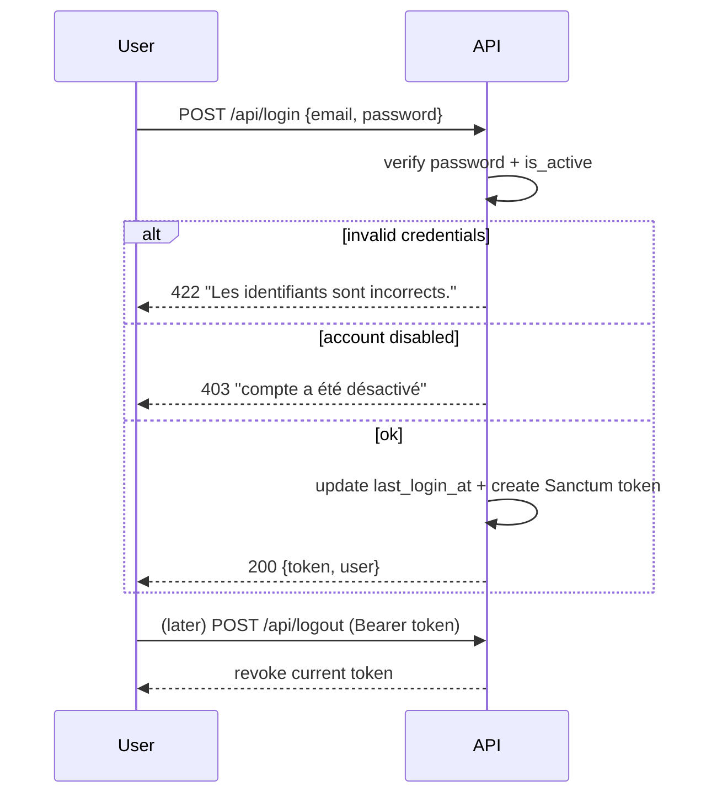
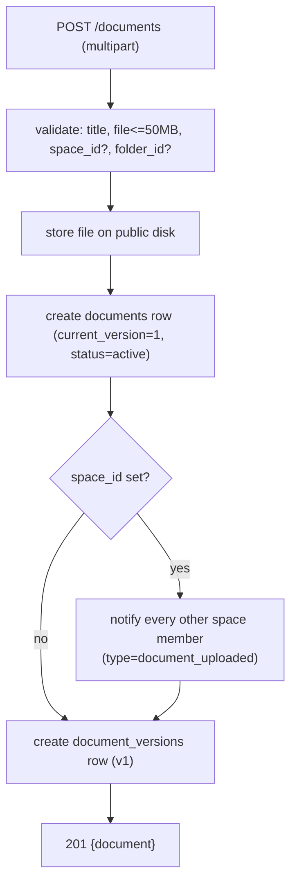
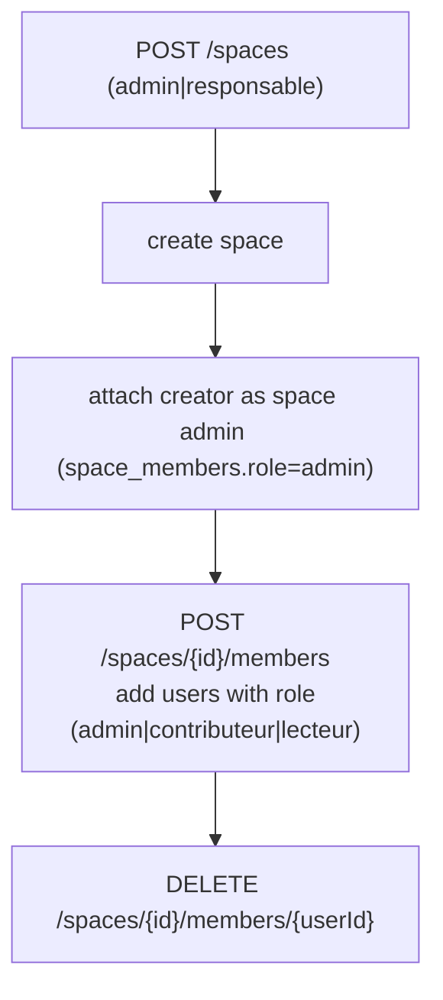
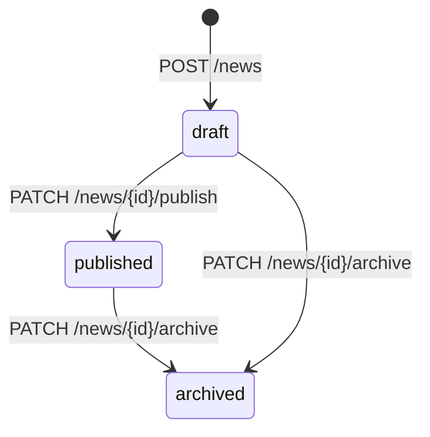
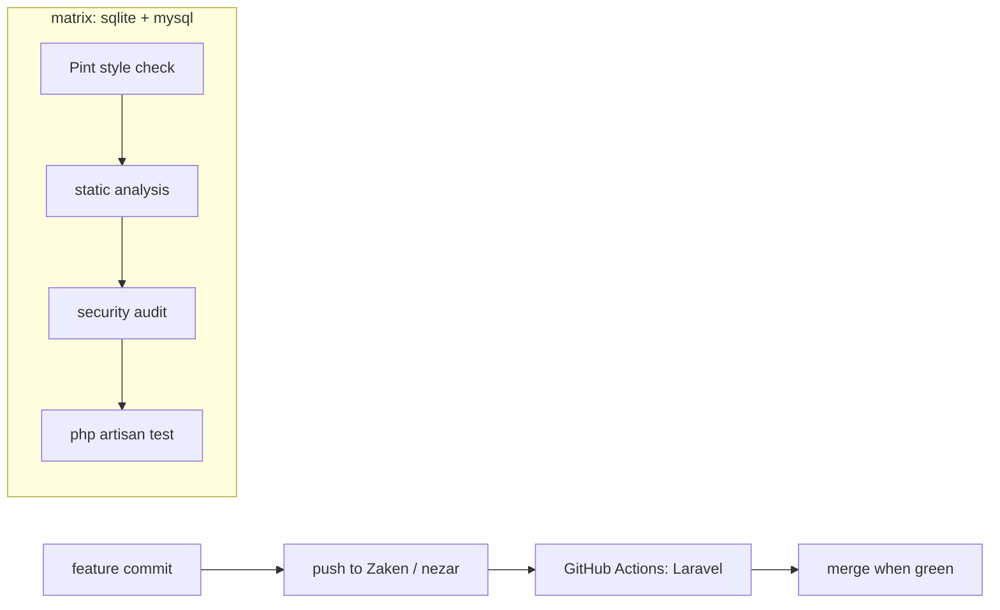

# get-2m — Workflows

This document describes both the **business workflows** exposed by the API and the
**development workflow** used to build and ship the project. See
[`ARCHITECTURE.md`](./ARCHITECTURE.md) for the structural view.

---

## Part A — Business workflows

### A.1 Authentication



Password reset is a two-step flow: `POST /forgot-password` emails a reset link,
`POST /reset-password` consumes the token and sets a new hashed password.

### A.2 Document upload & versioning



Lifecycle after upload:

- `PATCH /documents/{id}/trash` → soft state `status=trashed` + `trashed_at`.
- `PATCH /documents/{id}/restore` → back to `active`.
- `GET /documents/trashed` → list trashed items.
- `DELETE /documents/{id}` → **hard delete**: removes the stored file and force
  deletes the row (irreversible).

> Note: version history rows are created on the initial upload; adding a new
> version endpoint would append `document_versions` and bump
> `documents.current_version`.

### A.3 Spaces & membership



Reads (`GET /spaces`, `GET /spaces/{id}`) are open to any authenticated active
user; create/update/delete and membership changes require the global
`admin`/`responsable` role.

### A.4 News & comments



- Writing/publishing/archiving news requires `admin`/`responsable`.
- Any authenticated user may read published news and add/list/delete comments
  (`/news/{id}/comments`).
- News can target `all`, a `service`, or a `space` via `target` + `target_value`.

### A.5 Notifications

Controllers call `NotificationController::notify(...)` to create per-user rows.
Recipients then:

- `GET /notifications` — paginated list;
- `GET /notifications/unread-count` — badge counter;
- `PATCH /notifications/{id}/mark-read` / `PATCH /notifications/mark-all-read`;
- `DELETE /notifications/{id}`.

All notification endpoints are owner-scoped (a user can only touch their own).

### A.6 Search & dashboard

- `GET /search?q=&type=&service=&file_type=&from=&to=` runs `LIKE` queries across
  active documents, published news and spaces, with optional filters.
- `GET /dashboard` returns recent documents, latest pinned/published news, unread
  notifications, personal counts, and — for `admin` — global platform stats.

---

## Part B — Development workflow

### B.1 Branching & CI

The GitHub Actions workflow (`.github/workflows/laravel.yml`) runs on **push and
pull requests targeting the `Zaken` and `nezar` branches**.



The CI pipeline (per matrix DB) does: checkout → setup PHP 8.3 + Node 20 →
composer install → `npm ci && npm run build` → `key:generate` → Pint (`--test`)
→ static analysis → security audit → run tests against SQLite and MySQL.

### B.2 Local setup

```bash
composer install
cp .env.example .env
php artisan key:generate
touch database/database.sqlite      # if using SQLite
php artisan migrate
php artisan storage:link            # serve uploaded files
npm install && npm run build
composer run dev                    # serve + queue + logs + vite
```

### B.3 Quality gates (run before pushing)

```bash
vendor/bin/pint            # auto-fix code style (use --test in CI)
php artisan test           # run the Pest/PHPUnit suite
```

The `composer.json` scripts back these CI steps:
`static:analysis` → `phpstan analyse` and `security:audit` → `composer audit`
(both currently suffixed with `|| true`, so they report but do not fail the
build — drop the `|| true` once the codebase is clean to make them blocking).

### B.4 Testing

Unit tests live under `tests/Unit` (models + middleware); feature tests under
`tests/Feature`. Add feature tests per controller to cover the workflows above
(auth, upload/versioning, role guards, notifications).
